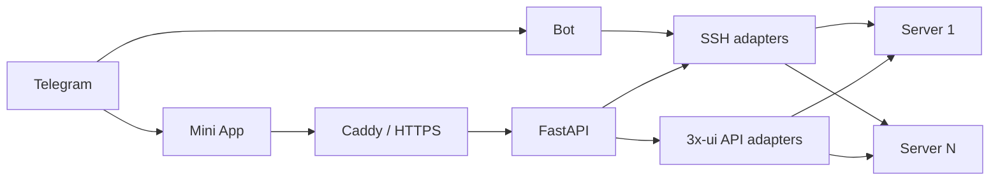
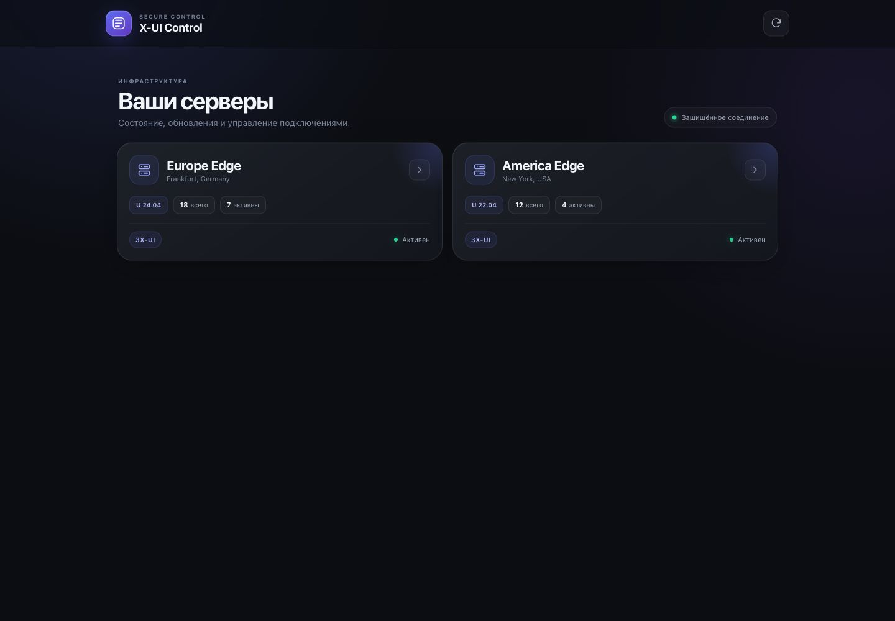
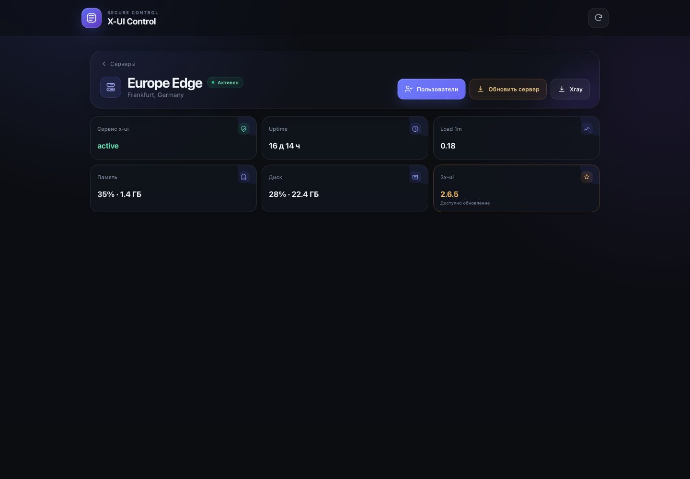
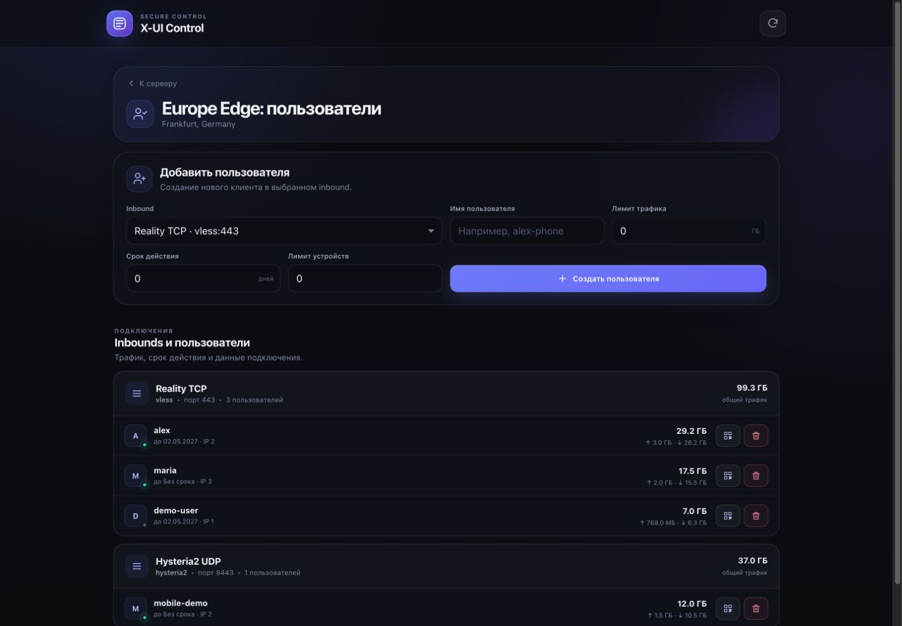
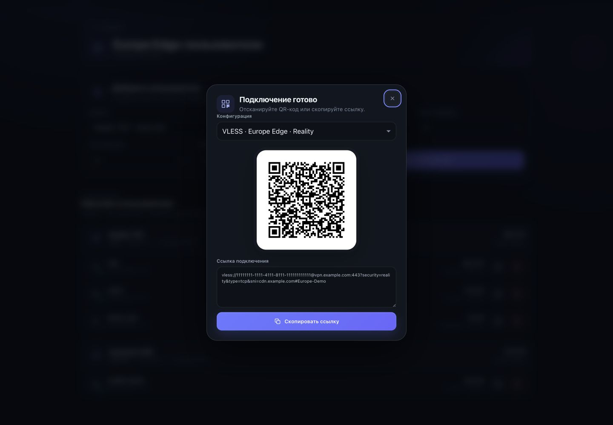

# X-UI Telegram Admin

A Telegram Mini App and bot for managing multiple [3x-ui](https://github.com/MHSanaei/3x-ui) servers through the panel API and SSH.

[Russian README](README.md) · [Installation](docs/installation.en.md) · [Usage](docs/usage.en.md) · [Configuration](docs/configuration.en.md) · [Screenshots](#screenshots) · [Troubleshooting](docs/troubleshooting.en.md) · [Support](#support-the-project)

## Features

- one control panel for any number of servers;
- OS, disk, memory, load average, uptime, and x-ui service status;
- inbounds, clients, traffic, and online status;
- client creation and deletion;
- exact connection links and QR codes generated by 3x-ui itself;
- multiple connection profiles for one client;
- comparison of the installed 3x-ui version with the latest stable release;
- a concise summary of release changes;
- safe Ubuntu and 3x-ui updates with backups;
- background operations with logs and status;
- `/status`, `/logs`, and `/updates` commands directly in Telegram;
- optional raw SSH available only through a dedicated unprivileged user;
- audit logging for administrative actions.

## Architecture



Servers are described in `config/servers.json`, while secrets are injected from `.env`. To add a server, add one inventory object, an SSH key, and a `known_hosts` entry. Parallel probes are bounded by `SERVER_PROBE_CONCURRENCY`, preventing an uncontrolled connection spike in large installations.

## Quick start

Requirements: a Linux application host, Docker Engine with Compose v2, a domain with TCP ports 80/443 open, a Telegram bot, and SSH access to the managed servers.

```bash
git clone https://github.com/Sampsih/3xui-telegram-bot.git
cd 3xui-telegram-bot

make bootstrap
nano .env
nano config/servers.json

make validate
make up
docker compose ps
```

The complete preparation of SSH users, Telegram, and panels is covered in the [installation guide](docs/installation.en.md).

## Bot commands

```text
/servers
/status <server_id>
/logs <server_id> [10-500]
/updates <server_id>
/ssh <server_id> <command>
```

`/ssh` is disabled by default. The application refuses to start when raw SSH is enabled for the `root` user.

## Security

- Telegram `initData` is verified by the backend;
- access is restricted to Telegram IDs in the allowlist;
- SSH host keys are verified through `known_hosts`;
- updates use fixed root-owned wrappers;
- arbitrary commands do not have root access;
- `.env`, secret-bearing inventories, SSH keys, audit data, and databases are excluded from Git;
- containers use read-only filesystems, no Linux capabilities, and `no-new-privileges`.

Read [SECURITY.en.md](SECURITY.en.md) before publishing your own fork.

## Documentation

- [Installation from scratch](docs/installation.en.md)
- [Usage](docs/usage.en.md)
- [All configuration parameters](docs/configuration.en.md)
- [Architecture and scaling](docs/architecture.en.md)
- [Repository map](docs/repository-map.en.md)
- [Development](docs/development.en.md)
- [Troubleshooting](docs/troubleshooting.en.md)
- [Contributing](CONTRIBUTING.en.md)
- [Changelog](CHANGELOG.md)
- [First GitHub publication](PUBLISHING.en.md)

## Screenshots

All servers, users, metrics, connection links, and QR codes shown below use fictional demo data.

| Servers | Server status |
| --- | --- |
|  |  |
| Users and inbounds | Connection link and QR code |
|  |  |

## Compatibility

The primary target is the current MHSanaei/3x-ui release. Older panels without `clients/subLinks` use a limited local link-generation fallback. Nonstandard forks may require a separate API adapter.

## Support the project

If this project is useful to you, you can support its continued development in any convenient way.

[](https://buymeacoffee.com/sampsih)

### TON (Gram)

Mainnet address:

```text
UQBDpkQH_ryzYKm5iiBQLuFz32SJllk4WI3drZfjQCYFHKX4
```

[Open a transfer in a TON wallet](ton://transfer/UQBDpkQH_ryzYKm5iiBQLuFz32SJllk4WI3drZfjQCYFHKX4?text=Thanks%20for%203xui-telegram-bot) · [Verify the address in TON Viewer](https://tonviewer.com/UQBDpkQH_ryzYKm5iiBQLuFz32SJllk4WI3drZfjQCYFHKX4)

Always verify the recipient address in your wallet before confirming a transfer.

## License

This project is licensed under the [GNU General Public License v3.0](LICENSE). You may use, study, modify, and distribute it, including commercially. When distributing the project or a derivative version, you must provide the source code and preserve the GPLv3 license.
