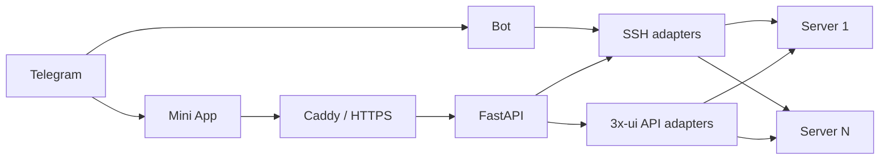

# X-UI Telegram Admin

Telegram Mini App и бот для управления несколькими серверами [3x-ui](https://github.com/MHSanaei/3x-ui) через API панели и SSH.

[English README](README.en.md) · [Установка](docs/installation.md) · [Использование](docs/usage.md) · [Конфигурация](docs/configuration.md) · [Решение проблем](docs/troubleshooting.md)

## Возможности

- единая панель для любого количества серверов;
- состояние ОС, диска, памяти, load average, uptime и сервиса x-ui;
- inbounds, клиенты, трафик и online-статус;
- создание и удаление клиентов;
- точные ссылки и QR из генератора самой 3x-ui;
- несколько конфигураций одного клиента;
- сравнение установленной версии 3x-ui с последним стабильным релизом;
- краткая выжимка изменений релиза;
- безопасное обновление Ubuntu и 3x-ui с резервным копированием;
- фоновые операции с журналом и статусом;
- команды `/status`, `/logs`, `/updates` непосредственно в Telegram;
- опциональный raw SSH только от отдельного непривилегированного пользователя;
- аудит административных действий.

## Архитектура



Серверы описываются в `config/servers.json`, а секреты подставляются из `.env`. Чтобы добавить сервер, достаточно добавить объект в инвентарь, SSH-ключ и запись `known_hosts`. Параллельные проверки ограничиваются `SERVER_PROBE_CONCURRENCY`, поэтому большая инсталляция не создаёт неконтролируемый всплеск соединений.

## Быстрый старт

Требования: Linux-сервер, Docker Engine с Compose v2, домен с открытыми TCP 80/443, Telegram-бот и SSH-доступ к управляемым серверам.

```bash
git clone https://github.com/Sampsih/3xui-telegram-bot.git
cd 3xui-telegram-bot

make bootstrap
nano .env
nano config/servers.json

make validate
make up
docker compose ps
```

Полная подготовка SSH-пользователей, Telegram и панелей описана в [инструкции установки](docs/installation.md).

## Команды бота

```text
/servers
/status <server_id>
/logs <server_id> [10-500]
/updates <server_id>
/ssh <server_id> <command>
```

`/ssh` выключена по умолчанию. Приложение не запустится, если raw SSH включён для пользователя `root`.

## Безопасность

- Telegram `initData` проверяется на backend;
- доступ разрешён только Telegram ID из allowlist;
- SSH host keys проверяются через `known_hosts`;
- обновления выполняют фиксированные root-owned wrappers;
- произвольные команды не имеют root-доступа;
- `.env`, инвентарь с секретами, SSH-ключи, аудит и базы исключены из Git;
- контейнеры работают с read-only filesystem, без Linux capabilities и с `no-new-privileges`.

Перед публикацией собственного fork изучите [SECURITY.md](SECURITY.md).

## Документация

- [Установка с нуля](docs/installation.md)
- [Использование](docs/usage.md)
- [Все параметры конфигурации](docs/configuration.md)
- [Архитектура и масштабирование](docs/architecture.md)
- [Карта репозитория](docs/repository-map.md)
- [Разработка](docs/development.md)
- [Решение проблем](docs/troubleshooting.md)
- [Участие в разработке](CONTRIBUTING.md)
- [История изменений](CHANGELOG.md)
- [Первая публикация на GitHub](PUBLISHING.md)

## Совместимость

Основная цель — актуальная MHSanaei/3x-ui. Старые панели без `clients/subLinks` используют ограниченный локальный fallback генерации ссылок. Нестандартные forks могут потребовать отдельный API adapter.

## Лицензия

Лицензия владельцем проекта пока не выбрана. До добавления файла `LICENSE` стандартные права на копирование и распространение автоматически не предоставляются.
